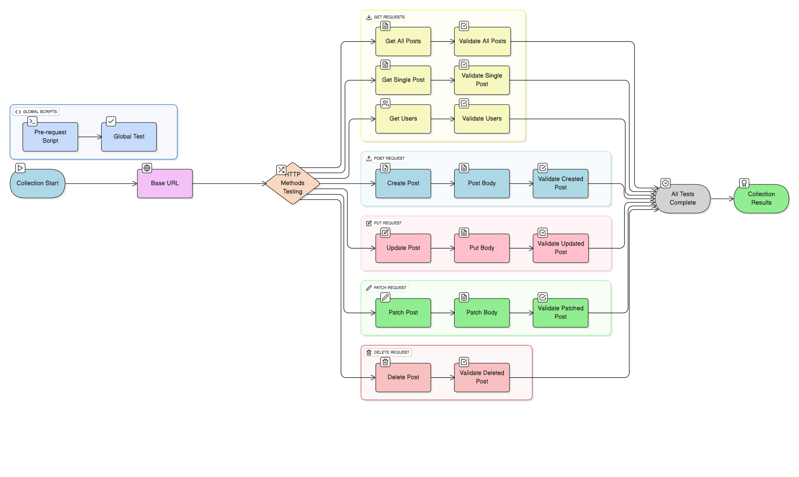

# JSONPlaceholder API Testing Collection

A comprehensive Postman collection for testing all HTTP methods using JSONPlaceholder - a free REST API for testing and prototyping.

## Overview

This collection provides complete API testing coverage for JSONPlaceholder endpoints, including all major HTTP methods with comprehensive test suites to validate response structure, data integrity, and performance.

## API Base URL
```
https://jsonplaceholder.typicode.com/
```

## API Testing Flow Diagram



## HTTP Methods Covered

### GET Requests
- **GET /posts** - Retrieve all posts
- **GET /posts/1** - Retrieve a specific post
- **GET /users** - Retrieve all users

### POST Request  
- **POST /posts** - Create a new post

### PUT Request
- **PUT /posts/1** - Update entire post (complete replacement)

### PATCH Request
- **PATCH /posts/1** - Partial update of post

### DELETE Request
- **DELETE /posts/1** - Delete a post

## Test Coverage

Each request includes comprehensive tests for:

- **Status Code Validation** - Ensures correct HTTP response codes
- **Response Format** - Validates JSON structure and data types  
- **Data Integrity** - Confirms request/response data matching
- **Performance** - Checks response times are within acceptable limits
- **Content-Type** - Verifies proper headers are returned
- **Field Validation** - Ensures all required fields are present

## Collection Structure

```
JSONPlaceholder API Testing Collection
├── GET - Get All Posts
├── GET - Get Single Post  
├── POST - Create New Post
├── PUT - Update Entire Post
├── PATCH - Partial Update Post
├── DELETE - Delete Post
└── GET - Users (Additional Endpoint)
```

## Setup Instructions

1. **Import Collection**
   - Download the `.json` file
   - Open Postman
   - Click "Import" → Select the JSON file

2. **Environment Variables**
   - Base URL is already configured as a collection variable
   - No additional setup required

3. **Run Tests**
   - Individual requests: Click "Send" on any request
   - Full collection: Use "Collection Runner"

## Sample Request Bodies

### POST Request Body
```json
{
    "title": "Test Post Title",
    "body": "This is a test post body",
    "userId": 1
}
```

### PUT Request Body
```json
{
    "id": 1,
    "title": "Updated Post Title", 
    "body": "This post has been completely updated",
    "userId": 2
}
```

### PATCH Request Body
```json
{
    "title": "Partially Updated Title"
}
```

## Expected Responses

### Successful GET Response
```json
[
    {
        "id": 1,
        "title": "sunt aut facere repellat provident occaecati excepturi optio reprehenderit",
        "body": "quia et suscipit...",
        "userId": 1
    }
]
```

### Successful POST Response (201)
```json
{
    "id": 101,
    "title": "Test Post Title",
    "body": "This is a test post body", 
    "userId": 1
}
```

### Successful DELETE Response (200)
```json
{}
```

## Test Results Summary

All requests include automated tests that verify:

- Correct HTTP status codes
- Valid JSON responses
- Required data fields present
- Data type validation
- Performance benchmarks
- Header validation

## Global Scripts

### Pre-request Script
- Logs request URL for debugging
- Available across all requests

### Global Tests  
- JSON response validation
- Runs after every request

## Performance Benchmarks

- GET requests: < 2000ms
- DELETE requests: < 1000ms  
- POST/PUT/PATCH: Standard response times

## Resources

- [JSONPlaceholder Documentation](https://jsonplaceholder.typicode.com/)
- [Postman Testing Guide](https://learning.postman.com/docs/writing-scripts/test-scripts/)
- [REST API Best Practices](https://restfulapi.net/)

